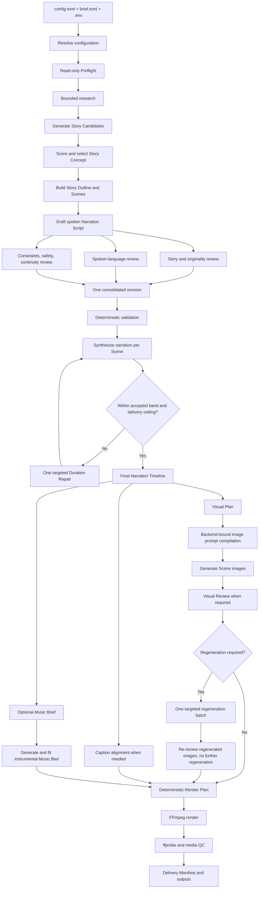

# Architecture

## Status and intent

This document defines the v0 architecture implemented by the local-first Python CLI that turns one Creative Brief into a narrated still-image video. The structure and contracts are implemented; actual provider/model readiness is established only by Setup, Preflight, and the user's first evaluation Runs.

The design supports local, cloud, and hybrid Runs without creating separate workflows for providers or languages. All Backends conform to the narrow protocols in [Contract design](contracts.md). The normal user chooses a curated Run Profile; advanced users may override individual Workflow Tasks.

The architecture deliberately avoids a general agent platform, plugin framework, workflow engine, database, and resource scheduler. The correct v0 is a fixed workflow, typed JSON artifacts, filesystem checkpoints, a static Backend registry, and one exclusive GPU lease.

## Production flow



Only research may iterate through tool calls, and it has hard query/source limits. Every other model operation is a finite structured transformation or review. The three reviews are independent inputs to one revision; they are not an unbounded discussion between agents.

## User-facing surface

The intended user-controlled files are:

- `config.toml`: Run Profile, Output Language, duration, quality, feature switches, Voice Profile references, and advanced task overrides;
- `brief.toml`: story direction and creative boundaries;
- `local-llm.toml`: one audited local GGUF/runtime/context/speculation benchmark variant;
- `.env`: credentials only.

Built-in profiles, prompt assets, schemas, Style Profiles, and Backend descriptors ship with the package. v0 has no config inheritance, includes, Python config files, or prompt plugin system. CLI flags override `config.toml`; the resolved, secret-free configuration is frozen into the Run Bundle.

The main commands are:

```text
video-generator setup [--profile NAME] [--backend ID] [--llm-profile local-llm.toml]
video-generator preflight --config config.toml
video-generator generate --config config.toml --brief brief.toml [--stop-after STAGE]
video-generator resume RUN_DIR
video-generator rerun RUN_DIR --from STAGE [--config config.toml]
video-generator evaluate --suite smoke|draft-quality|quality [--language en|fi]
video-generator runs prune [--older-than DAYS]
```

`generate` runs end to end by default. `--stop-after` is an explicit inspection tool. `setup` may download pinned assets into `./.cache/models`; Preflight and Generate never perform surprise model downloads.

## Layers

| Layer | Responsibility | Must not own |
| --- | --- | --- |
| CLI/configuration | Parse inputs, resolve profiles, show readiness/cost, dispatch commands | provider logic, model loading |
| orchestration | Execute the fixed stage sequence, enforce budgets/retries, checkpoint, resume | vendor payloads, FFmpeg filter construction |
| domain/contracts | Validate provider-neutral artifacts and invariants | SDK objects, secrets |
| task executor | Render a versioned task prompt, call a compatible Backend, validate structured output | open-ended autonomy |
| Backend adapters | Translate one narrow capability contract to a provider/runtime | workflow decisions, hidden fallback |
| local runner manager | Platform launch, health probes, exclusive GPU lifecycle, path mapping | creative logic, VRAM bin-packing |
| media services | Probe/normalize audio, create captions, build FFmpeg commands, media QC | generative-model selection |
| Run store | Atomic artifact promotion, hashes, stage status, logs, usage/provenance | a database or cross-Run cache |

This split lets the same story workflow use OpenAI, Gemini, a manifest-selected local GGUF, ElevenLabs, VoxCPM, FLUX, or future replacements without those names appearing in domain models.

## Stage ordering and GPU residency

The logical branches after the final Narration Timeline can run concurrently in cloud-only profiles. On the one local GPU they execute sequentially. v0 does not estimate whether two models might fit at once.

The runner manager should batch adjacent calls, while accepting bounded reloads required by measured results:

1. keep the selected LLM resident for research reduction, ideation, selection, outline, writing, and the three reviews;
2. release it, load TTS, and synthesize all Scenes;
3. only when duration misses: release TTS, reload the `duration_repair` LLM, then reload TTS for the changed Scenes;
4. after the final Narration Timeline, load the assigned text Backend(s) for `visual_plan`, `image_prompt_compile`, and optional `music_brief`, grouping only tasks that actually share a model;
5. load alignment only if captions need it;
6. load the image model for all initial Scene images;
7. load the vision reviewer when required;
8. if review requests corrections, reload the image model for one regeneration batch, then reload the reviewer to assess those images once more;
9. load the music model when music is enabled;
10. release all model processes before FFmpeg rendering.

This is an optimization over the same artifact contracts, not a different workflow. Each Scene item is independently validated and atomically promoted, so an unhealthy runner can fail the aggregate stage without losing already completed items.

Native Windows is the default placement. The implemented LLM, VoxCPM, faster-whisper, FLUX,
ACE-Step, media, and orchestration paths are native. The retained Parakeet/NeMo alignment adapter is
an explicit WSL2 comparison Backend, never a requirement for the default local profile.

The Structured Text adapter starts one stock `llama-server.exe` on a dynamically selected loopback port with a generated in-memory API key. The adjacent LLM task batch reuses that child process. A model-family switch terminates it, requires process exit and disappearance of its GPU PID when observable, and records baseline/load/peak/post-exit aggregate VRAM. Aggregate return-to-baseline is advisory under Windows WDDM because unrelated applications may change GPU use.

Context and speculative decoding are launch properties. The selected `local-llm.toml` therefore freezes one context tier and one `none` or `draft-mtp` variant. A larger context is a bounded relaunch/evaluation case, not a per-request toggle or an automatic 256K promise.

## Scene, narration, and duration

A Scene combines one variable-length spoken passage and one primary visual. Scene planning targets a new visual about every 15 seconds, normally between 8 and 25 seconds, with justified opening/closing exceptions. This yields roughly 4–8 images for a 90-second Run and 30–50 for ten minutes.

TTS runs per Scene because this gives natural checkpoint and regeneration boundaries. The Speech contract may include surrounding text context for continuity, while provider-specific continuation controls remain inside the adapter. Each returned clip is probed, conservatively boundary-trimmed if required, normalized, and concatenated. Declared pauses are explicit timeline data, not invisible padding.

The Duration Budget is both goal and hard content-timeline limit. Before narration acceptance, the media layer rounds the maximum usable clock down to the nearest 30 fps frame boundary. Encoded-file QC permits at most one video frame of AAC/container padding beyond that timeline. A successful narration uses at least 85% of the configured budget and ends at or before the delivery ceiling. Measured audio, not word-count prediction, decides acceptance. One Duration Repair may alter and resynthesize selected Scenes while preserving Scene IDs and order. If repaired narration is still short, a final pitch-preserving tempo fit may slow it only as far as 0.85× and only when bounded Scene pauses can place the result inside the accepted band; otherwise the Run stops. The pipeline never speeds speech, truncates narration, or silently drops content.

FFmpeg is capped to the same delivery ceiling. The visual stream may outlast narration by less than one frame so the final spoken audio is not cut, but the delivered file never exceeds `duration_seconds`.

## Captions

Captions are enabled by default. Cloud TTS character timing is normalized into word timing when available. Local TTS uses an Alignment Backend only when captions are enabled; Scene cuts need only clip durations.

For local alignment, the exact Narration Script remains canonical. faster-whisper or Parakeet can
propose recognized words and timestamps, but deterministic reconciliation maps those timings back
onto the known text and reports coverage. Neither may silently rewrite Finnish or English caption
text based on ASR mistakes.

One Caption Track produces:

- `captions.srt` for portability;
- a selectable `mov_text` track in the primary MP4;
- when requested, a separate MP4 with ASS/libass captions rendered into the pixels.

Animated captions are a presentation transform over the same timing data, not a second alignment path.

## Images and continuity

Visual planning happens after the Narration Timeline is final. It creates a provider-neutral Visual Plan containing the resolved Style Profile, recurring Character Identities, and one Visual Brief per Scene. The separately assigned `image_prompt_compile` Structured Text task then uses versioned target-Backend instructions to create each validated Image Request. The Run records both the compiler Backend/model and the Image Backend; they need not come from the same provider.

Generative models are the intended production path. The deterministic stick renderer is an explicitly selected Backend for contract tests and emergency manual choice; it is never a silent substitution for a failed image call.

The continuity target is recognizable semantics, not pixel identity. Signature traits, recurring props, color anchors, and relative relationships persist while poses and small drawing inconsistencies may vary. Where a Backend supports references, selected character sheets or prior images can be attached. Final-quality profiles may score each image against brief fulfillment, style, identity, composition, forbidden text/watermarks, and family-safety. All failed images are regenerated in at most one targeted batch, then those replacements are reviewed once more. They cannot trigger another regeneration; a remaining hard failure stops a strict Run.

Generated images are normalized deterministically to the Delivery Format. For example, GPT Image 2 should generate at a legal 16:9 size such as 2048×1152 rather than invalid 1920×1080, then the media layer scales/crops to the final frame.

## Research and factual mode

Fiction research is inspiration: motifs, settings, vocabulary, unexpected details, cultural cautions, and clichés to avoid. The default bounds are five search queries and ten retained sources. Full webpage dumps are not copied into every later prompt.

Factual mode is a stricter branch, not a vague fiction/fact hybrid. It additionally requires evidence records, atomic claim IDs, claim-to-source links, and a source-grounded factual review before TTS. Factual mode must remain disabled in the implementation until those artifacts and checks exist. In Offline Runs it requires supplied source material and may not claim currentness.

Search is its own supporting Backend binding. Provider-native OpenAI web search, Gemini grounding, and an independent search API are separate implementations. Query limits are enforced from actual calls and persisted source metadata, not trusted to prompt wording alone. v0 does not fetch arbitrary result pages: it retains only provider-grounded URLs and bounded excerpts returned by the selected Search Backend. A future factual mode may add a separately audited, address-pinned fetch contract.

## Music and audio mix

Music is an implemented option but is off by default. When enabled, its Workflow Task is required unless the selected Failure Policy explicitly permits omission with a visible warning. It is instrumental, generated only after the final narration duration is known, and shaped by a compact Music Brief derived from the story's emotional arc.

The Music Backend declares its observed duration limit. The media layer trims, fades, or crossfades a generated Music Bed to the Narration Timeline; music never extends the video. A Backend that only generates a short clip may be used only when the profile explicitly permits deterministic looping. Narration remains the dominant mix. Initial audio mixing should use measured loudness normalization, conservative fixed music gain, and a limiter; dynamic ducking can be added only if listening fixtures show it is necessary.

## Rendering and media QC

The deterministic Render Plan contains no model decisions. FFmpeg holds each normalized image for its Scene interval, applies hard cuts, combines the master narration and optional Music Bed, and writes H.264/AAC MP4 with `yuv420p`, 30 fps, and fast-start metadata.

Preflight checks FFmpeg capabilities rather than assuming a version string is sufficient: H.264 encoding, AAC, `mov_text`, SRT, ASS/libass when animated captions are requested, and ffprobe. An installed build is not declared supported until those probes pass; the first real render remains the final integration check.

Media QC verifies:

- expected streams and codecs;
- 16:9 resolution and 30 fps;
- monotonically ordered Scene and caption timing;
- duration equal to the Narration Timeline rounded to the frame grid and at or below the hard Duration Budget;
- no missing/corrupt image or audio asset;
- selectable captions when enabled;
- audible narration and no clipping after the mix.

## Run Bundle and resumption

The filesystem is sufficient for v0:

```text
runs/<run-id>/
  manifest.json
  inputs/
    config.resolved.json
    brief.json
    frozen-assets/
  stages/
    010-research/attempt-001/
    020-ideate/attempt-001/
    ...
  outputs/
  logs/
  work/
```

A scalar stage writes only under `work/`, validates all outputs, then atomically promotes them and updates `manifest.json`. Fan-out stages give every Scene its own work directory and atomically promoted item manifest; the stage is marked complete only after all required items exist. Each record stores its input hashes, relevant config hash, task/prompt/schema versions, Backend/model revision, attempt count, usage, runtime, output hashes, and warnings.

At Run creation, the exact selected profile, task instructions, prompt assets, and JSON Schemas are copied into `inputs/frozen-assets/` with hashes. Ordinary `resume` uses those frozen assets, reuses matching completed work, and never silently repeats a paid call. It can continue pending stages after a package upgrade only when the installed adapter/runtime remains compatible.

`rerun RUN_DIR --from STAGE [--config config.toml]` is the one explicit invalidation operation. After showing the affected stages and new estimate, it creates a new immutable Run Bundle with `parent_run_id` and `fork_stage`, carries forward independently verified upstream artifacts with their original provenance, and resolves current or supplied configuration/assets for the chosen stage onward. If new configuration invalidates an earlier artifact, it refuses the requested fork and reports the earliest valid stage. It never mutates the parent. Cross-Run caching beyond this explicit parent-child carry-forward and a generic artifact graph are deferred.

Run Bundles are preserved by default. `runs prune` is explicit. Model assets live separately in `./.cache/models` so pruning output never deletes prepared Backends.

## Budgets, failures, and safety

Every model call has bounded attempts and output size. The Cost Ceiling reserves a conservative maximum before each cloud call using a dated pricing snapshot. Actual tokens, images, TTS characters, music duration, tool queries, retries, and cost are recorded. Local Runs record elapsed time and model revision. The llama-server worker also records its process lifecycle and before/load/peak/post-exit GPU observations; other worker families retain process-exit checks and may add equivalent telemetry after acceptance.

Preflight rejects missing capabilities, credentials, model assets, license compatibility, disk capacity, Output Language support, and impossible feature combinations. It never responds by changing the Run Profile. Setup may prepare exactly the missing item.

The default `family_safe_general` Audience Profile allows mild suspense, peril, sadness, and non-graphic conflict. It excludes explicit sexual content, graphic violence, profanity, hateful stereotypes, detailed self-harm, and glamorized drug use. A deterministic constraint check and a bounded model review run before expensive TTS/image/music stages.

Voice references are private inputs under `private/`, excluded from version control and normal logs. Run Bundles retain only their authorization/provenance metadata and content hashes, not copied recordings. Credentials are read from environment variables and never frozen into artifacts.

## Curated profiles

The v0 names describe the leading creative provider, not every service involved:

- `local`: local generation plus optional independent live search; fully Offline when requested;
- `cloud-openai`: OpenAI-led text/images, ElevenLabs narration/music, local FFmpeg;
- `cloud-gemini`: Gemini-led text/images, ElevenLabs narration/music, local FFmpeg;
- `cloud-openai-gemini`: pinned GPT-5.4 mini text, Gemini images, ElevenLabs narration/music,
  keyless DDGS search, local FFmpeg;
- `hybrid-local-first`: local text/images/music, with ElevenLabs narration/timing for the highest-value cloud quality gain.

Profile mappings are versioned and printed by Preflight. They never dynamically route based on price or failure. Advanced task overrides are validated through the same descriptors and contracts.

## Implemented package shape

```text
src/video_generator/
  cli.py
  config.py
  contracts.py
  local_llm.py
  workflow.py
  prompting.py
  profiles.py
  executor.py
  registry.py
  setup.py
  preflight.py
  provenance.py
  runners.py
  run_store.py
  media.py
  backends/
  workers/
  assets/runners/
tests/
```

One reusable structured-task executor serves the text roles, and one static registry serves Backend lookup.

## Explicit v0 non-goals

- GUI, web service, publishing, or channel upload;
- arbitrary provider plugins or user-authored workflows;
- multi-speaker dialogue or mid-Run language switching;
- portrait/square delivery, video-generation models, camera motion, or transitions beyond hard cuts;
- multiple images within one Scene;
- concurrent local GPU models, multi-GPU scheduling, or VRAM bin-packing;
- pixel-perfect recurring characters;
- automatic commercial-rights conclusions;
- silent fallback, endless self-review, or open-ended agent collaboration.
